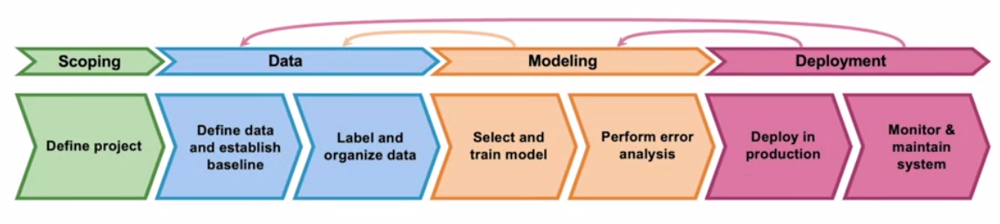
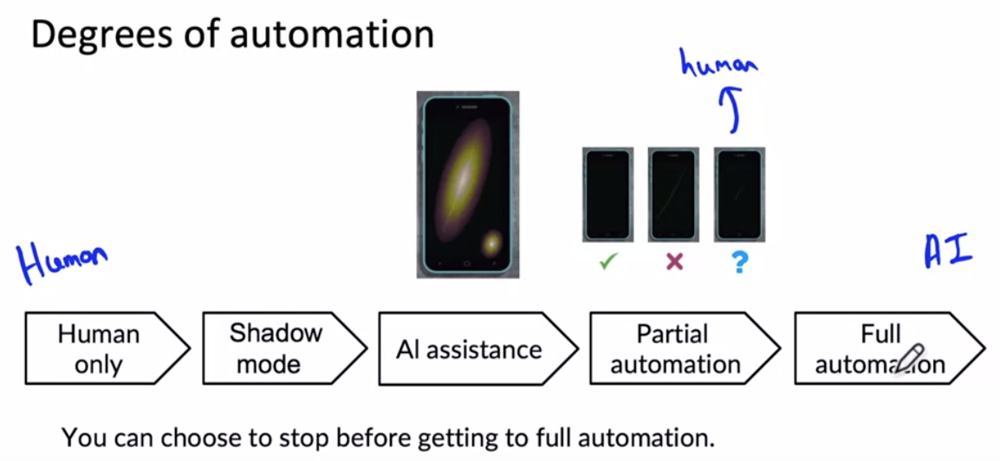

# Week 1

#### ML Lifecycle

#### Concept drift and data drift

- Concept drift: changes of f(x) -> y, e.g. housing price inflation
- Data drift: changes of data distributions x, e.g. housing size becomes bigger

#### Software Engineering Issues

##### Checklist of questions

- Real-time or Batch
- Cloud vs Edge/Browser
- Compute resources (CPU/GPU/memory)
- Latency, throughput (QPS)
- Logging
- Security and privacy

#### Deployment Pattern

- Shadow mode
  - Run parallel with manual system and do not make any impact to the system
- Canary deployment
  - Roll out to small fraction of traffic initially, then monitor system and ramp up traffic gradually
- Blue green deployment
  -  Easy way to enable rollback

#### Degrees of automation

#### Monitoring dashboard

- Software metrics
  - Memory, compute, latency, throughput, server load
- Input metrics
  - Avg input length
  - Avg input volume
  - num of missing values
  - Avg image brightness
- Output metrics
  - num of times return "" (null)
  - num of times user redoes search
  - num of times user witches to typing
  - Click through rate (CTR)

#### Pipeline Monitoring

- Monitor
  - Software metrics
  - Input metrics
  - Output metrics
- How quickly do they change?
  - User data generally has slower drift
  - Enterprise data (B2B applications) can shift fast

