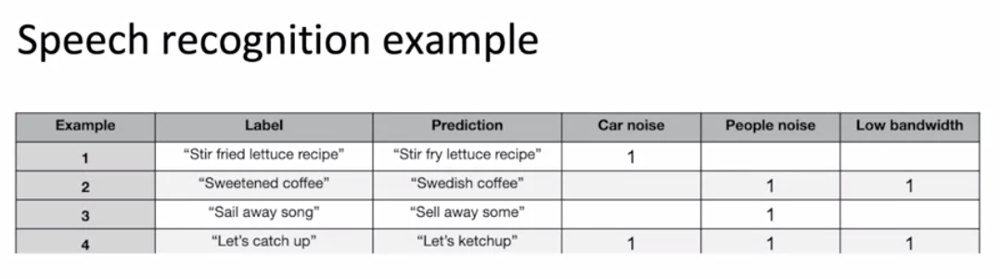
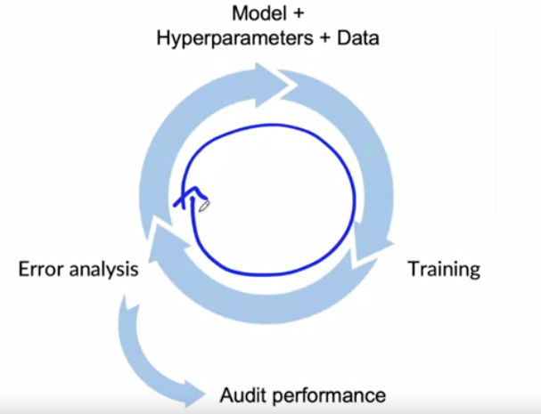
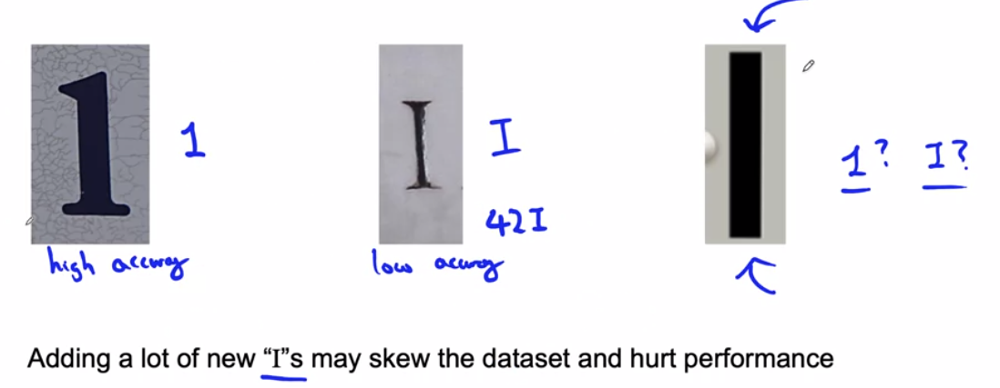

# Week 2: Select and Train a Model

### Performance on disproportionately important examples

- Informational and Transactional queries, e.g. "Apple pie recipe".
- (Important because it is usually not forgiving to give wrong result) Navigational queries, e.g. "Reddit"

### Performance on key slices of the dataset

- Example: ML for loan approval
  - Make sure not to discriminate by ethnicity, gender, location language or other protected attributes.
- Example: Product recommendations from retailers
  - Be careful to treat fairly all major user, retailer, and product categories.

### Rare classes

- Skewed data distribution
  - 99% negative, 1% positive

### Way to establish a baseline

- Human level performance (HLP)
- Literature search for state-of-the-art / open source
- Quick-and-dirty implementation
- Performance of older system

Baseline helps to indicates what might be possible. In some cases (HLP) is also gives a sense of what is irreducible error / Bayes error.

HLP is generally more effective for establishing a baseline on unstructured data problems, such as images and audio.

### Getting started on modelling

- Literature search to see what's possible (courses, blogs, open-source projects).
- Find open-source implementations if available.
- A reasonable algorithm with good data will often outperform a great algorithm with not so good data.
- Tips: Don't obsess about taking the most cutting-edge algorithm, instead use a reasonable good open source implementation to start quickly. This helps to loop through the ML iterations quickly.

### Deployment constraints when picking a model

- **Not necessary** to take into account when establishing a baseline to determine what is possible and might be worth pursuing.
- If baseline is established and goal is to build and deploy, then **should** take into account the deployment constraints when picking a model.

### Sanity-check for code and algorithm

- Try to overfit a small training dataset before training on a large one.

### Error Analysis

- 

- 
- Useful metrics for each tag
  - What fraction of errors has that tag?
  - Of all data with that tag, what fraction is misclassified?
  - What fraction of all the data has that tag?
  - How much room for improvement is there on data with that tag?

### Prioritizing what to work on

- Decide on most important categories to work on based on:
  - How much room for improvement there is.
  - How frequently that category appears.
  - How easy is to improve accuracy in that category.
  - How important it is to improve in that category.
- 

### Adding / improving data for specific categories

- For categories you want to prioritize:
  - Collect more data
  - Use data augmentation to get more data
  - Improve label accuracy / data quality

### Skewed dataset

- Examples
  - **Manufacturing**, 99.7% no defect, 0.3% defect
  - **Medical Diagnosis**, 99% negative, 1% positive
  - **Wake word detection**, 96.7% of the time doesn't occur
- Confusion matrix
  - Precision and Recall
- Combine Precision and Recall
  - F1 score, put more weight on low value
- 

### Performance Auditing

- 

## Auditing framework

Check for accuracy, fairness / bias, and other problems

1. Brainstorm the ways the system might go wrong.
   1. Performance on subsets of data (e.g. ethnicity, gender)
   2. How common are certain errors (e.g. FP, FN)
   3. Performance on rare classes.
2. Establish metrics to assess performance against these issues on appropriate slices of data. TFMA is a good tool helps to visualize this information.
3. Get business / product owner to discuss on the problem found, before pushing the model into deployment.

### Speech recognition example

1. Brainstorm the ways the system might go wrong
   1. Accuracy on different genders and tthnicities.
   2. Accuracy on different devices.
   3. Prevalence of rude mis-trascriptions. (e.g. GAN -> gun or gang)
2. Establish metrics to assess performance against these issues on appropriate slices of data.
   1. Mean accuracy for different genders and major accents.
   2. Mean accuracy on different devices.
   3. Check for prevalence of offensive words in the output.

## Data-centric AI development

### Why data augmentation can be useful

Improve performance on certain data is likely to improve performance on similar data, especially unstructured data.

### Data augmentation

- Goal: Create realistic examples that 
  - (i) the algorithm does poorly on, but 
  - (ii) humans (or other baseline) do well on.
- Checklist:
  - Does it sound realistic?
  - Is the x->y mapping clear? (e.g. can humans recognize?)
  - Is the algorithm currently doing poorly on it?

### Data iteration loop

### Can adding data hurt?

Rare for unstructured data, especially image data.

#### Photo OCR counterexample

### Adding features

- Collaborative filtering: match user to similar users and see if they like the restaurant.
- Content based filtering: based on restaurant description, predict if the user like it or not.
  - This solves the cold-start problem, meaning the new restaurant that nobody has made a review before. 

### Data Iteration

- Error analysis can be harder if there is no good baseline (such as HLP) to compare to.
- Error analysis, user feedback and benchmarking to competitors can all provide inspiration for features to add.

### Experiment tracking

- What to track?
  - Algorithm / code version
  - Dataset used
  - Hyperparameters
  - Results
- Tracking tools
  - Text files
  - Spreadsheet
  - Experiment tracking system
- Desirable features
  - Information needed to replicate results
  - Experiment results, ideally with summary metrics / analysis
  - Perhaps also: Resource monitoring, visualization, model error analysis

### From Big Data to Good Data

Try to ensure consistently high-quality data in all phases of the ML project lifecycle.

Good data:

- Covers **important cases** (good coverage of inputs x)
- Is defined **consistently** (definition of labels y is unambiguous)
- Has timely feedback from production data (distribution **covers data drift and concept drift**)
- Is sized appropriately

## Week 2 Optional References

### Week 2: Select and Train Model

If you wish to dive more deeply into the topics covered this week, feel free to check out these optional references. You won’t have to read these to complete this week’s practice quizzes. 

[Establishing a baseline](https://blog.ml.cmu.edu/2020/08/31/3-baselines/)

[Error analysis](https://techcommunity.microsoft.com/t5/azure-ai/responsible-machine-learning-with-error-analysis/ba-p/2141774)

[Experiment tracking](https://neptune.ai/blog/ml-experiment-tracking)

**Papers**

Brundage, M., Avin, S., Wang, J., Belfield, H., Krueger, G., Hadfield, G., … Anderljung, M. (n.d.). Toward trustworthy AI development: Mechanisms for supporting verifiable claims∗. Retrieved May 7, 2021http://arxiv.org/abs/2004.07213v2

Nakkiran, P., Kaplun, G., Bansal, Y., Yang, T., Barak, B., & Sutskever, I. (2019). Deep double descent: Where bigger models and more data hurt. Retrieved from http://arxiv.org/abs/1912.02292